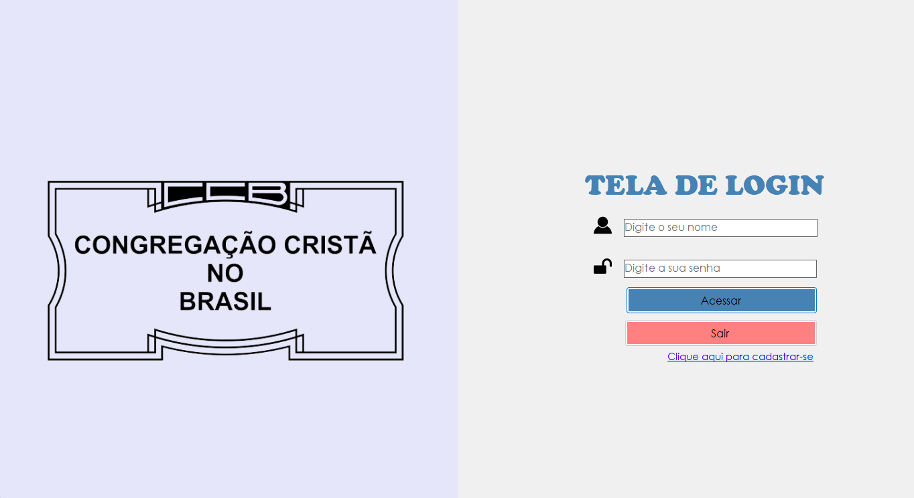
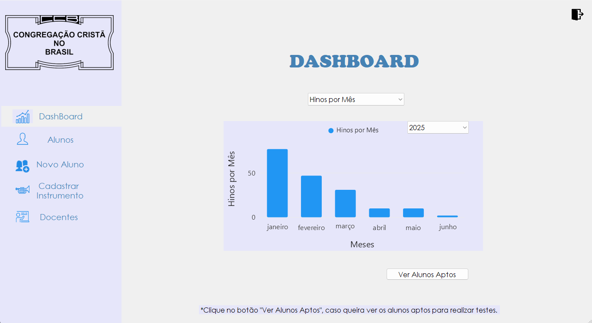
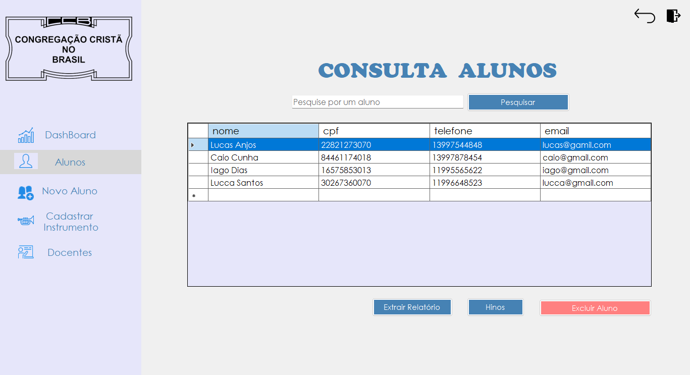
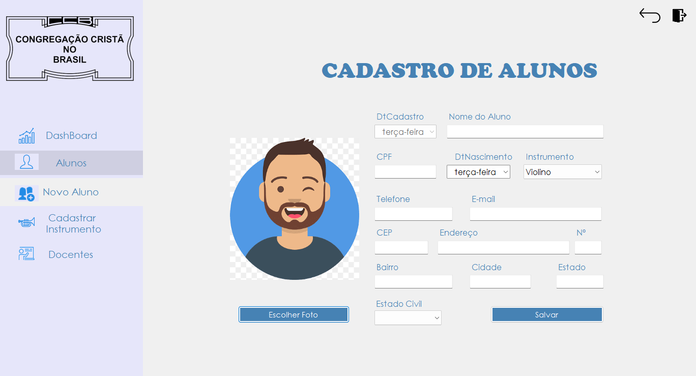
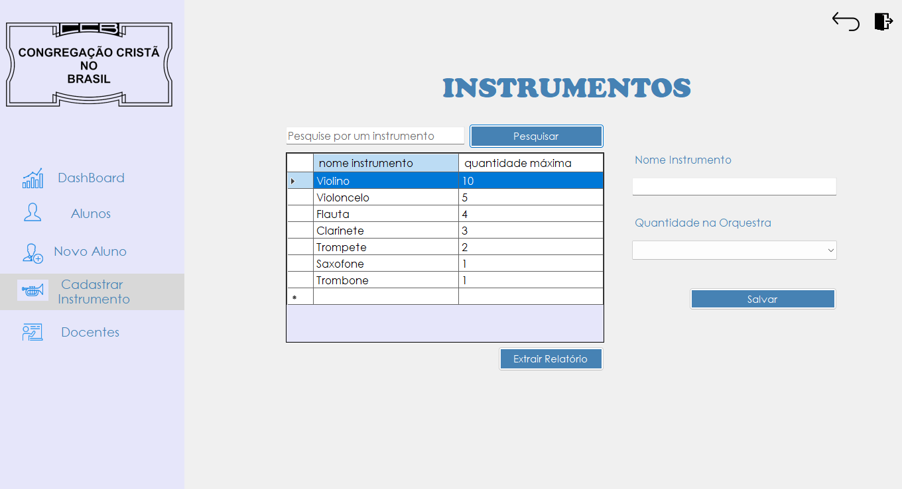
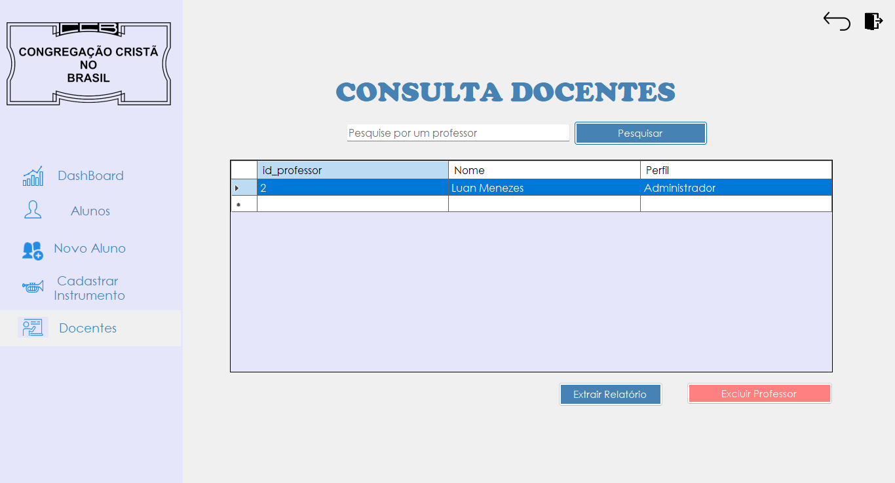

# Grupo de Estudos Musicais da Congregação Cristã no Brasil

  
</p

SGEM-CCB (Sistema para Grupos de Estudos Musicais da Congregação Cristã no Brasil) é um projeto desenvolvido como TCC para o curso técnico em Desenvolvimento de Sistemas da instituição Liceu Santista entre março de 2024 e junho de 2025. 

## Sumário
- [Introdução](#introdução)
- [Tecnologias](#tecnologias)
- [Funcionalidades](#funcionalidades)
- [Screenshots](#screenshots)

## Introdução
Este projeto tem como objetivo o desenvolvimento de um sistema desktop em C# com Windows Forms, voltado ao gerenciamento de processos do GEM( Grupo de Estudos Musicais) da Congregação Cristã. A aplicação busca otimizar processos que antes eram feitos manualmente, proporcionando maior controle, organização e acessibilidade.
 
## Tecnologias
As tecnologias utilizadas foram:
- **[C# Windows Forms](https://docs.microsoft.com/en-us/dotnet/framework/winforms/)** Linguagem e o framework utilizados no desenvolvimento da aplicação
- **[MySQL](https://www.mysql.com)** Banco de dados da aplicação

## Funcionalidades
- Controle de Hinos por Alunos
- Controle de Hinos por mês
- Controle de alunos por instrumentos
- Verificação do nível de aptdão dos alunos
- Controle de instrumentos disponíveis
- Controle de docentes (Administradores e professores)
- Extração de relatórios diretamente para o Excel

## Screenshots

